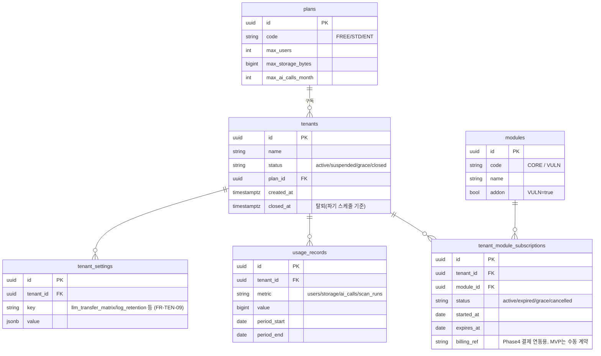
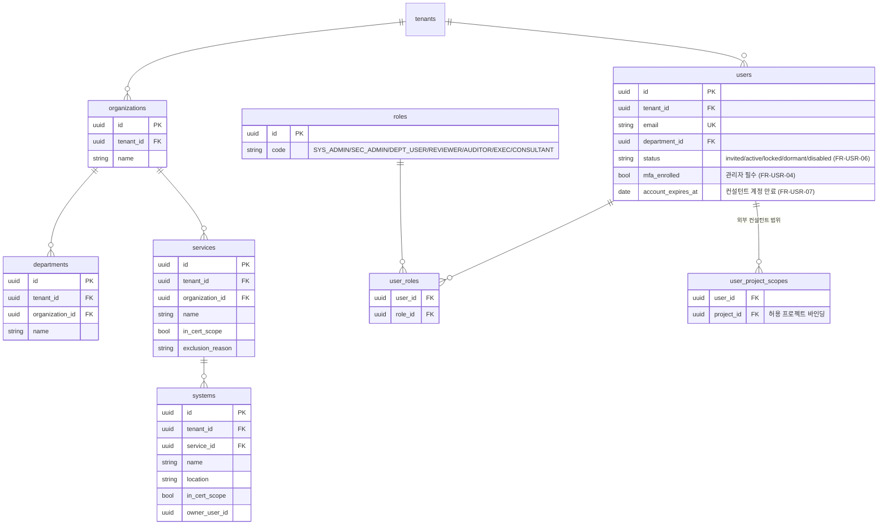
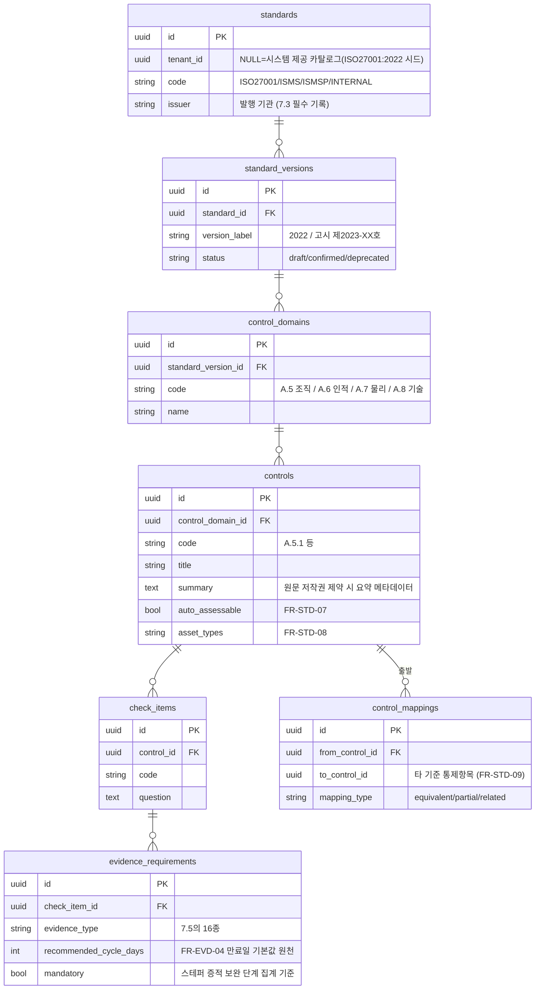
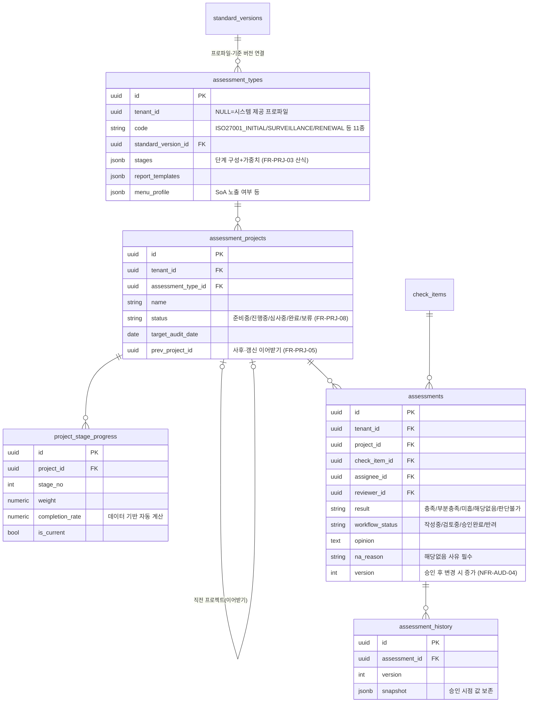
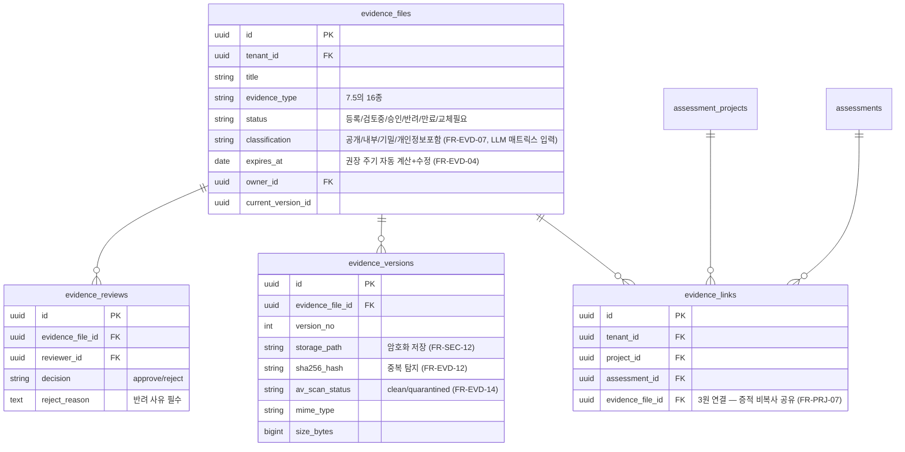
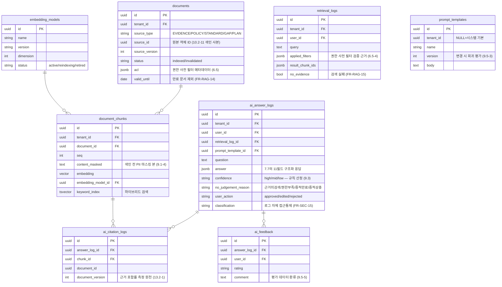
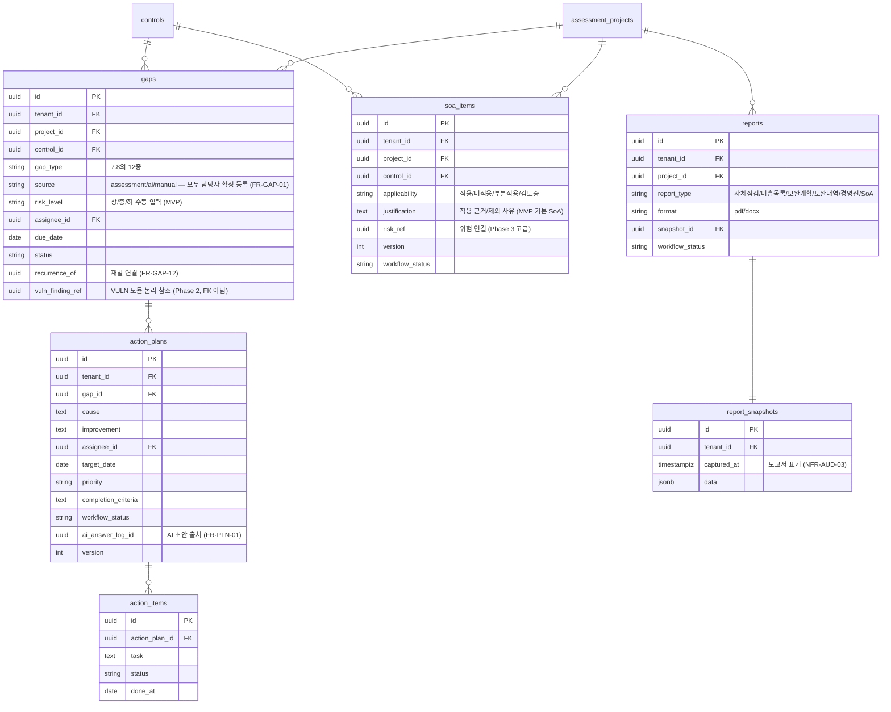
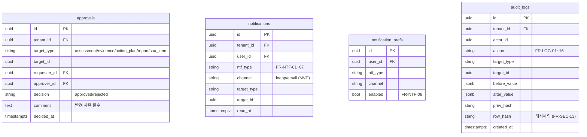
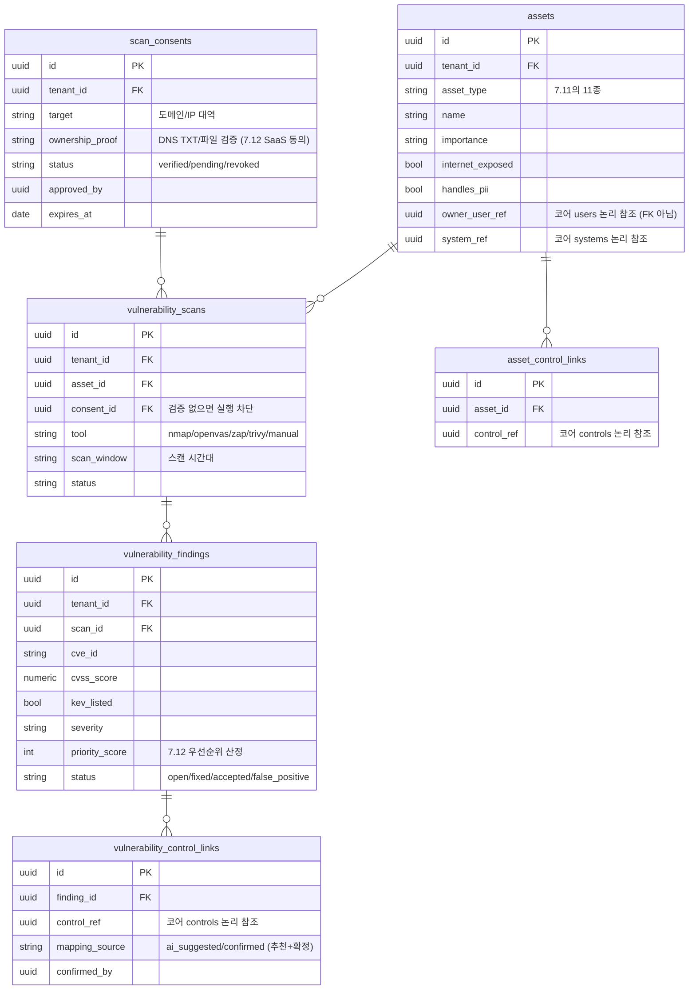

# AI-ISMS Manager ERD 초안 v0.1

| 항목 | 내용 |
|---|---|
| 기준 문서 | AI_ISMS_PRD_v0.4.md (10장 데이터 모델), AI_ISMS_FSD_v0.1.md |
| DBMS | PostgreSQL 15+ (pgvector 확장) |
| 작성일 | 2026-06-11 |

---

## 1. 설계 원칙

1. **테넌트 격리 (FR-TEN-07, NFR-SCL-06)**: 모든 업무 테이블은 `tenant_id NOT NULL`을 가지며 PostgreSQL Row-Level Security(RLS) 정책으로 강제한다. 애플리케이션 계층 필터에만 의존하지 않는다.
2. **시스템 제공 콘텐츠 vs 테넌트 콘텐츠**: 기준 카탈로그(`standards` 계열)는 `tenant_id NULL` 허용 — NULL이면 시스템 제공 콘텐츠(예: ISO/IEC 27001:2022 시드)로 전 테넌트가 읽기 전용 공유하고, 테넌트 커스텀 기준은 자신의 `tenant_id`로 생성한다. `plans`, `modules`, `embedding_models`는 플랫폼 전역 테이블이다.
3. **모듈 경계 (2.4, 10.2-18)**: 취약점 모듈(VULN) 테이블은 코어(CORE) 테이블에 DB FK를 걸지 않고 **ID 논리 참조**만 사용한다 — 모듈 미구독 테넌트에는 빈 영역이고, 향후 별도 서비스/DB로 분리 배포가 가능해야 한다. 코어→VULN 참조(`gaps.vuln_finding_ref`)도 논리 참조다.
4. **증적 3원 연결 (FR-PRJ-07)**: 증적은 복사하지 않고 `evidence_links(project_id, assessment_id, evidence_id)`로 연결한다. 점검 결과는 프로젝트별 분리, 증적은 공유.
5. **승인본 보존 (NFR-AUD-04)**: 점검·개선계획 등 승인 대상은 버전 칼럼과 이력 테이블로 승인 시점 값을 보존한다.
6. **임베딩 모델 버전 (10.2-12)**: 청크는 `embedding_model_id`를 가지며, 모델 교체 시 재색인·병행 운영을 지원한다.
7. **감사로그 (FR-SEC-13)**: append-only + 해시체인(`prev_hash`, `row_hash`).
8. **ISO27001 우선 (2.4-5)**: 초기 시드 데이터는 ISO/IEC 27001:2022 — 통제 테마 4개(조직/인적/물리/기술), Annex A 93개 통제, 심사 유형 프로파일 3종(최초/사후/갱신). 원문 저작권 제약(20장)에 따라 통제 제목·요약 메타데이터 수준으로 시드하고, 원문은 고객 라이선스 보유 시 등록한다.

---

## 2. 도메인별 ERD

### 2.1 플랫폼 / SaaS (FR-TEN)

- 기능 게이팅(FR-TEN-04): API 게이트웨이와 각 서비스가 `tenant_module_subscriptions`를 이중 검증한다(16장 리스크 "모듈 게이팅 우회").
- `usage_records.metric='scan_runs'`는 VULN 모듈 과금 지표.

### 2.2 조직 / 사용자 (FR-ORG, FR-USR)

- 인증 범위 변경 이력(FR-ORG-10)은 8절 `audit_logs`로 기록(승인자·사유 포함).

### 2.3 기준 / 콘텐츠 (FR-STD)

### 2.4 심사 프로젝트 / 점검 (FR-PRJ, FR-CHK)

- 인증 준비율(FR-DSH-01) = `assessments`에서 (충족·승인완료 + 0.5×부분충족·승인완료) / 평가 대상(해당없음 제외) — 프로젝트/전사 단위 집계 뷰(머티리얼라이즈드 뷰)로 구현.

### 2.5 증적 (FR-EVD)

- 상태 전이(승인→색인 반영, 만료·반려·교체→색인 무효화)는 이벤트로 2.6 파이프라인에 전파(FR-EVD-10, 11).

### 2.6 RAG / AI (FR-RAG, FR-AIA)

### 2.7 미흡사항 / 개선계획 / SoA / 보고서 (FR-GAP, FR-PLN, FR-SOA, FR-RPT)

### 2.8 승인 / 알림 / 감사 (FR-WFL, FR-NTF, FR-LOG)

- `approvals`는 MVP 단일 단계 — P1 다단계 확장 시 `step_no`, `delegation` 칼럼 추가 여지를 둔다(7.16 승인 범위).
- `audit_logs`는 append-only(UPDATE/DELETE 권한 회수) + 파티셔닝(보관기간 정책, 7.19).

### 2.9 취약점 진단 모듈 (VULN 애드온 — FR-AST, FR-VUL, Phase 2)

- 이 도메인 전체가 VULN 구독 게이팅 대상: 미구독 테넌트는 API·메뉴·배치에서 차단(FR-TEN-04), `usage_records.scan_runs`로 사용량 과금.
- 코어와의 연결은 전부 `*_ref` 논리 참조 — 모듈 분리 배포 시 서비스 간 API 참조로 전환 가능.

---

## 3. RLS 정책 요약

| 대상 | 정책 |
|---|---|
| 모든 업무 테이블 | `tenant_id = current_setting('app.tenant_id')::uuid` 강제 |
| standards 계열, assessment_types, prompt_templates | 위 조건 OR `tenant_id IS NULL`(시스템 콘텐츠 읽기 전용) |
| plans, modules, embedding_models | 플랫폼 전역(테넌트 정책 미적용, 쓰기는 플랫폼 관리자만) |
| document_chunks 벡터 검색 | RLS + 질의 시 `tenant_id`·ACL 사전 필터 이중 적용 (6.5) |
| audit_logs | INSERT만 허용(append-only) |

## 4. PRD 10장과의 대응

PRD 10.1의 47개 테이블 중 `knowledge_sources`는 `documents.source_type/source_id`로 흡수, `embeddings`는 `document_chunks` 내장 칼럼으로 구현(임베딩 모델 버전 포함), `integrations`(P1)와 `risks/risk_treatments/exceptions`(Phase 3)는 해당 Phase 설계 시 추가한다. 본 ERD는 MVP+Phase 2(VULN) 범위의 물리 설계 초안이며, 신규 추가 테이블(`evidence_versions`, `evidence_links`, `scan_consents`, `notification_prefs`, `tenant_settings`, `user_project_scopes` 등)은 PRD 요구사항의 구현 필요에 따른 상세화다.

## 5. 개발 착수 시 권장 순서 (ISO27001 우선)

1. 플랫폼 골격: tenants/modules/subscriptions + RLS + 게이팅 미들웨어 (이후 모든 기능의 전제)
2. ISO/IEC 27001:2022 시드: standards→controls 93개→check_items→evidence_requirements, 심사 유형 프로파일 3종
3. 코어 업무 흐름: 프로젝트 생성→체크리스트→증적→승인 (스테퍼 포함)
4. RAG/AI: 색인 파이프라인→검색→응답/인용 로그
5. 미흡사항→개선계획→SoA→보고서
6. Phase 2: VULN 모듈 (scan_consents 소유권 검증부터)
